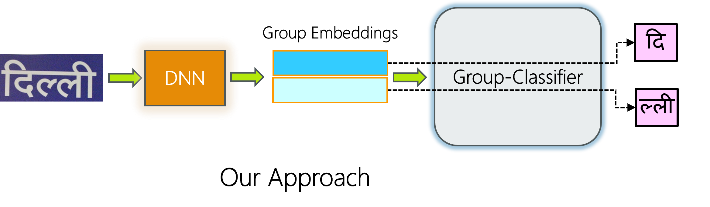

# Installation 
requires python ~ 3.10, uses pytorch-lightning ~ 2.1.0
To install dependecies run:
```
pip install -r requirements.txt
```

# Getting Started
Project uses Hydra, read more about [Hydra](https://hydra.cc/docs/intro/). The project consists of 2 modules [CharEmbed](https://github.com/RohitMNair/IndicSTR/tree/master/CharEmbed) and [GroupNet](https://github.com/RohitMNair/IndicSTR/tree/master/GroupNet). 
CharEmbed comprises embedding models tailored to identify a single character group present within images containing a single character group. These models are utilized to obtain character embeddings.
GroupNet is a collection of Scene Text Recognition models. It is designed to accurately decipher the complete textual content present within an image.

| Embedding Net | Group Nets Overview |
|---------------|---------------------|
|  |  |

## Datasets
Training data has been generated synthetically using [SynthTIGER](https://github.com/clovaai/synthtiger). Steps to generate data can be found in their repo. [IndicSTR12](https://iiitaphyd-my.sharepoint.com/:f:/g/personal/harsh_lunia_research_iiit_ac_in/ElB2rbzq2xtJtrcFWO3azvcBgX5qqNAX_CCluTC4gSHEDA?e=86YzEr) has been used for evaluation. 

| Malayalam Synthetic Images | Hindi Synthetic Samples |
|----------------------------|-------------------------|
|  |  |

### Data Preparation
Dataloaders expect data to be in [LMDB](https://lmdb.readthedocs.io/en/release/), to convert a dataset to LMDB run:
```
python tools/create_lmdb.py <image_folder> <ground_truth_file> <desitnation_folder> <check_valid_flag>
```
The ground truth file is expected to be space separated: `<image_path> <label>`, and all images must be in a single folder.

To merge 2 datasets use `tools/merge_datasets.py` as so:
```
python3 tools/merge_datasets.py -d1 <dataset1> -d2 <dataset2> -m <dataset_merged>
```
"d1" and "d2" are directories containing the 2 datasets. If out of the 2 datasets to be merged, one is bigger, keep the bigger dataset as d1. The datasets must have file structure similar to SynthTIGER datasets as so:-
```
/dataset
    ├── images
    │   ├── image_folder_1
    |   |   ├── image1.jpg
    │   |   ├── image2.jpg
    │   |   └── ...
    |   ├── image_folder_2
    |   |   ├── image10001.jpg
    │   |   ├── image10002.jpg
    │   |   └── ...   
    |   ├── ....
    ├── gt.txt
```

# GroupNet
## Training
Specify model configs in `main.yaml` and run:
```
python GroupNet/train.py
```

## Test
Specify configurations in `configs/test.yaml` and run:
```
python GroupNet/test.py
```

# CharEmbed
## Training
Specify model configs in `main.yaml` and run:
```
python CharEmbed/train.py
```